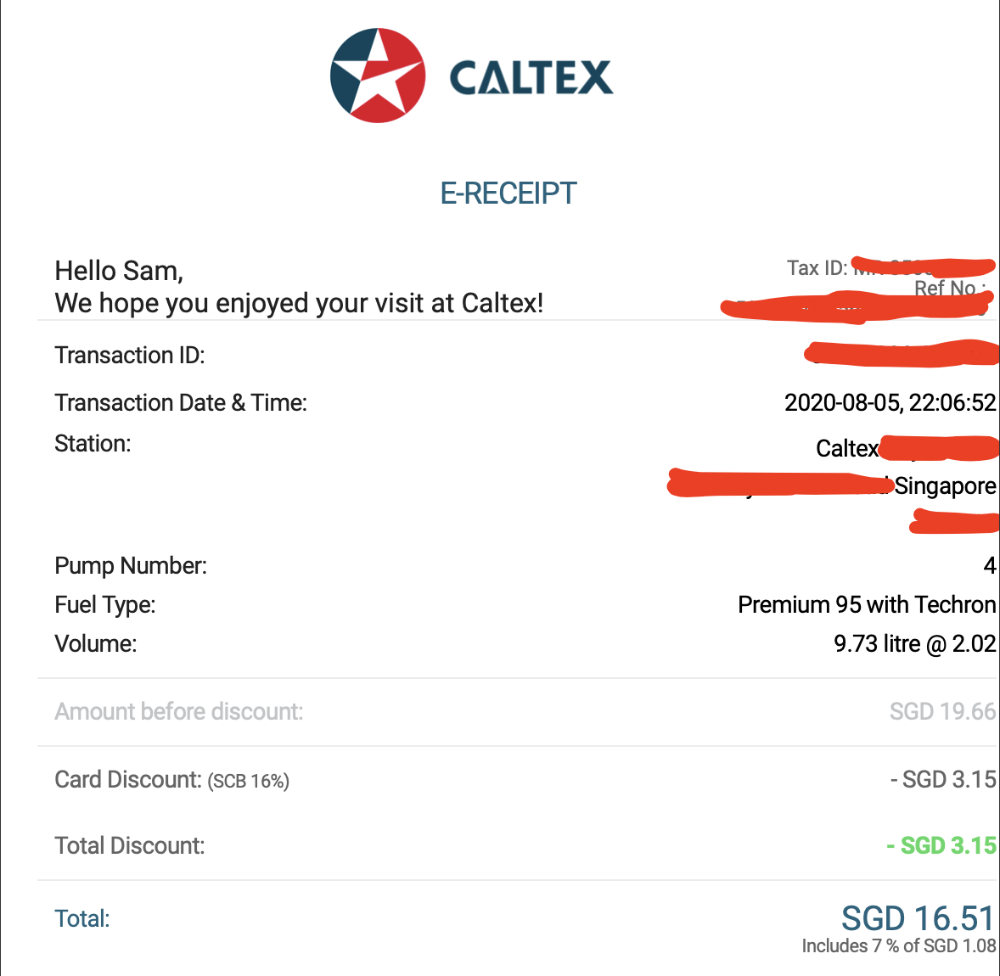
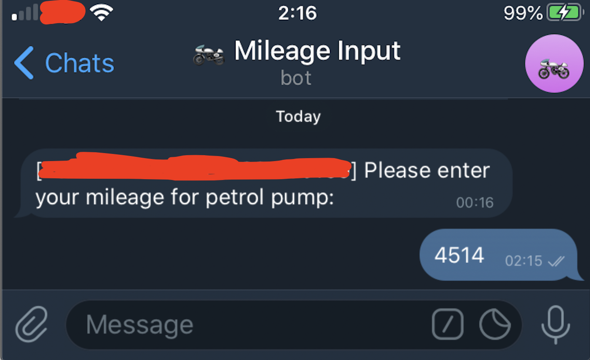
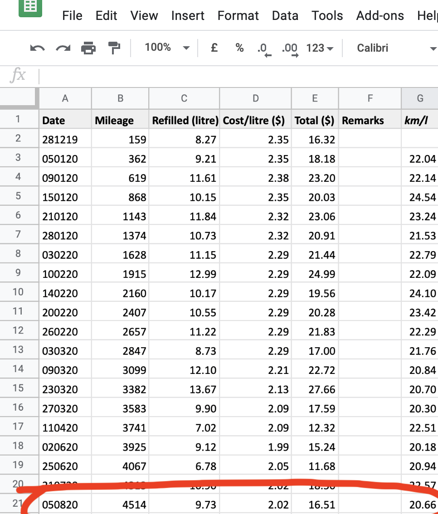

 # Petrol Usage Logger
Got sick of manually updating my vehicle's petrol usage (litres refuelled, cost per litre, total cost etc.) in Google Sheets, and haphazardly hacked together some code to automatically update my spreadsheet whenever Caltex emails me the receipt with all these details. Now I only need to enter my mileage (the only variable which cannot be automated) whenver my Telegram bot prompts me to after each refuel.

Uses the following py packages:

Uses  | Version |For
------------- | - | -------------
gspread |  3.6.0 | Python API for Google Sheets API v4
inbox.py | 0.0.6 | Simple SMTP server (with hotfix [here](https://github.com/ohsyln/inbox.py/blob/master/inbox.py))
oauth2client | 4.1.3 |  Google's OAuth2
requests | 2.24.0 | GET reqs to Telegram API

Also uses Google Sheets API and Telegram Bot API.

## General Flow

1. CaltexGO sends a receipt email to my email address (e.g. eater@ieatcaltexgoreceipts.com)

<br/>

2. My SMTP server (e.g. hosted in *ieatcaltexgoreceipts.com*; you can get free dynamic ip [here](https://www.noip.com)) eats the receipt email and parses it (**petrol-logger.py**).

3. **petrol-logger.py** parses and extracts my vehicle's petrol usage information.

4. **petrol-logger.py** sends a Telegram message through my bot, prompting input of current mileage.

<br/>

5. Once **petrol-logger.py** has the required information, it updates my spreadsheet via Google Sheets API.

<br/>

### Prerequisites (Raspbian/macOS/Ubuntu)

The entire setup requires enabling Google Sheets API on your spreadsheet (easy step-by-step guide [here](https://towardsdatascience.com/accessing-google-spreadsheet-data-using-python-90a5bc214fd2)), setting up a Telegram Bot (easy step-by-step guide [here](https://medium.com/@wk0/send-and-receive-messages-with-the-telegram-api-17de9102ab78)), and ensuring that your SMTP server is accessible through the web (e.g. port-forward your computer, or use some hosting services).

Install python3 and pip3, in the system hosting the script (I used a Raspberry Pi Zero):

```
sudo apt-get install python3
sudo apt-get install python3-pip
```

### Installing

Clone to your local directory:

```
git clone https://github.com/ohsyln/petrol-usage-log
cd petrol-usage-log
```

Create virtual environment, and activate:

```
python3 -m venv pyenv
. pyenv/bin/activate
```

Install the required packages using pip3 into your virtual environment:
```
pip3 install gspread oauth2client requests inbox.py
```

## Run script

Edit `API_KEY` and `API_CHAT_ID` in `petrol-logger.py` with a text editor:

```
API_KEY = "<YOUR TELEGRAM BOT API KEY HERE>"
API_CHAT_ID = "<YOUR TELEGRAM BOT CHAT ID HERE>"
```

Add your `account_key.json` (Google Sheets API credentials) in the same folder as `petrol-logger.py`.

Save changes and run script, which is an SMTP server listener that waits for receipts from CaltexGO

```
python3 petrol-logger.py
```

## License

MIT
